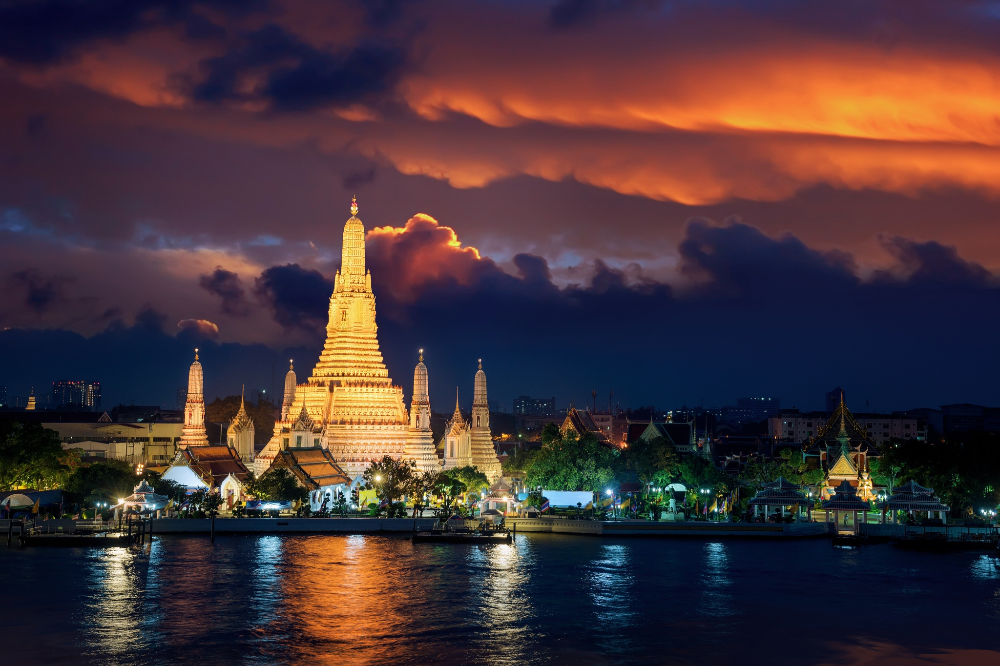
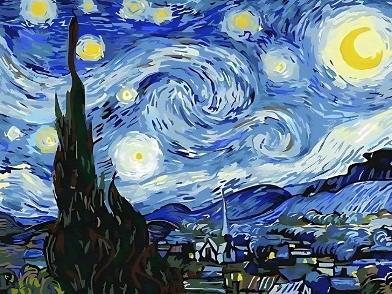
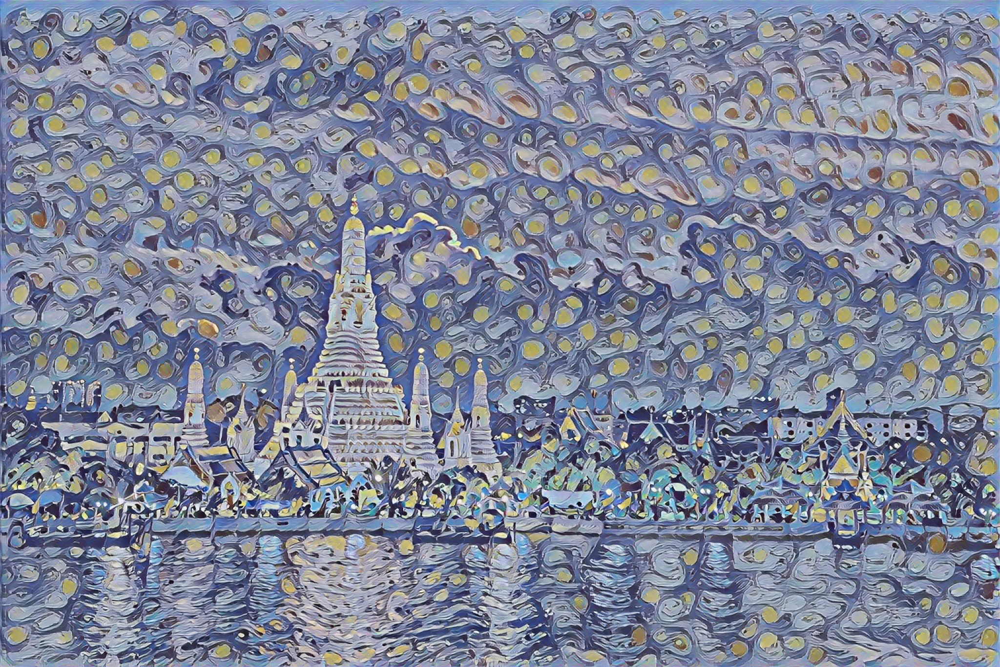
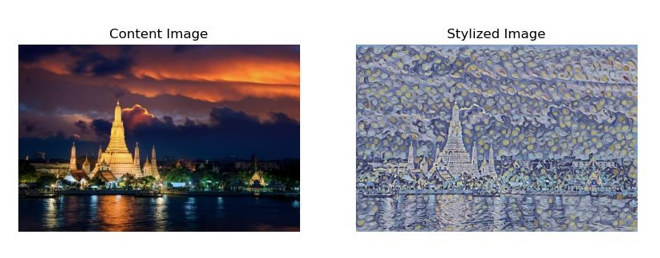

# Neural Style Transfer with TensorFlow

## Overview
This project implements Neural Style Transfer using TensorFlow Hub's pre-trained arbitrary image stylization model. The script allows you to transfer the artistic style of one image onto the content of another image.

## Prerequisites
- Python 3.x
- TensorFlow
- TensorFlow Hub
- Matplotlib
- OpenCV
- NumPy

## Installation
```bash
pip install tensorflow tensorflow-hub matplotlib opencv-python numpy
```

## How It Works
Neural Style Transfer combines the original of one image (original image) with the artistic style of another image (style image) using a deep learning model from TensorFlow Hub.

## Example
In this example, we transfer the style of Van Gogh's "Starry Night" to an image of Wat Arun temple in Bangkok.

### Input Images
1. Original Image: Wat Arun Temple


2. Style Image: Starry Night by Van Gogh


### Output Stylized Image


## Comparison Result


## Usage
1. Place your original and style images in the same directory
2. Update the file paths in `main()` function
3. Run the script

```bash
python main.py
```

## Functions
- `load_image()`: Loads and preprocesses images
- `show_InputImage()`: Displays input images
- `stylize_image()`: Applies neural style transfer
- `show_OutputImage()`: Displays and saves output images

## Output
The script generates two output files:
- `comparison_output.jpg`: Side-by-side comparison of original and stylized images
- `output.jpg`: Final stylized image

## Model
Uses Google's Magenta Arbitrary Image Stylization model from TensorFlow Hub
